### Question 2.2

|Task|Mean return (BC)|STD (BC)|Mean return (expert)|STD (expert)|
|---|---|---|---|---|
|Hopper-v2|1860.27|444.31|3779.27|2.97|
|Ant-v2|4803.19|165.30|4788.46|102.76|
|HalfCheetah-v2|4208.68|86.97|4105.91|72.27|
|Humanoid-v2|874.53|328.83|10380.54|58.80|
|Reacher-v2|-5.77|1.99|-3.45|1.51|
|Walker2d-v2|3142.17|822.97|5505.50|46.97|

### Question 2.3

  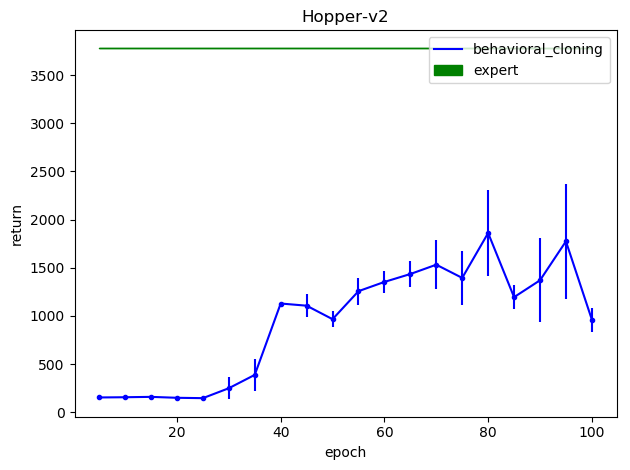
  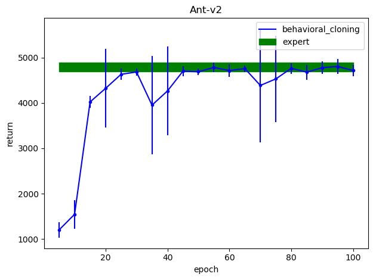
  
  
  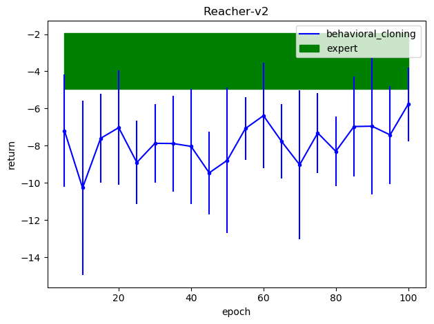
  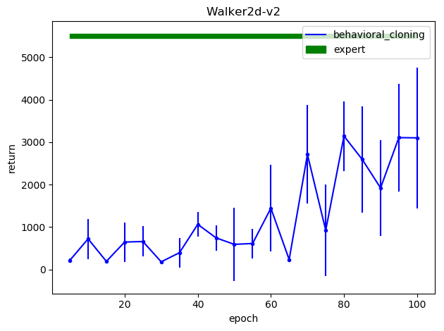

### Question 3.2

  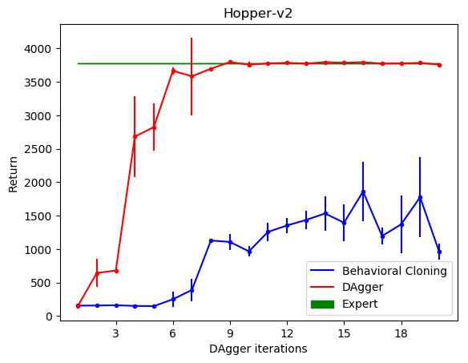
  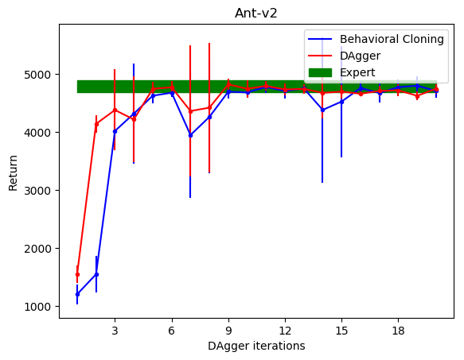
  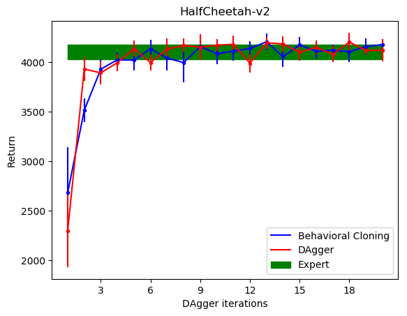
  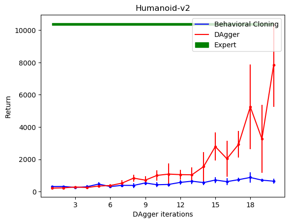
  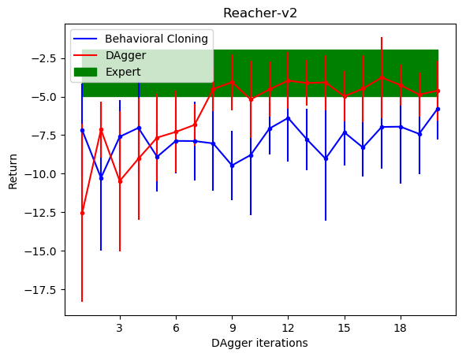
  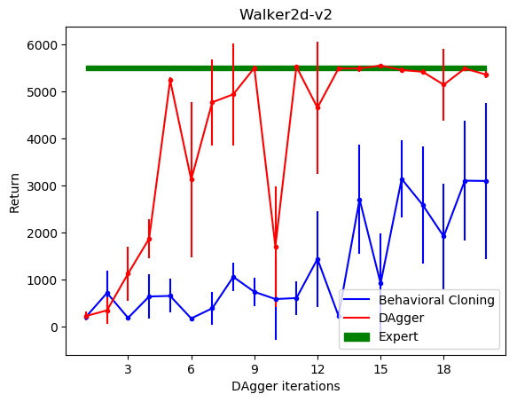

### Question 4.1

  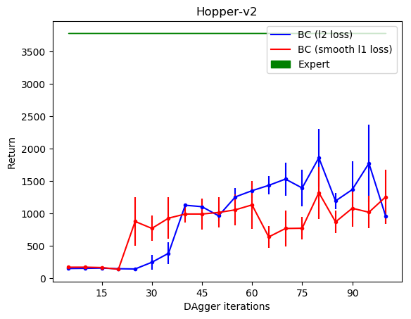
  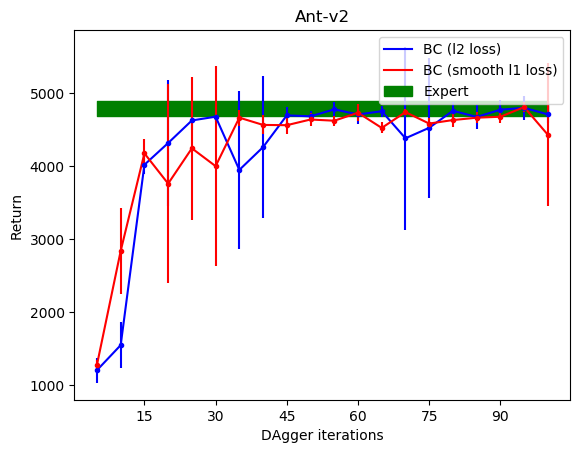
  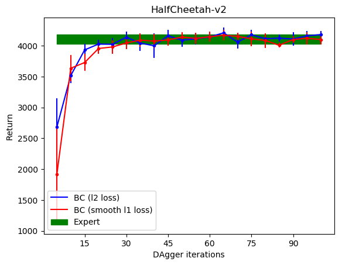
  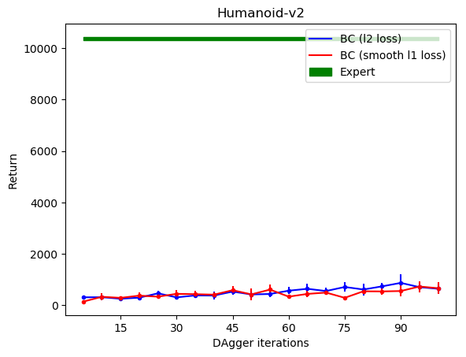
  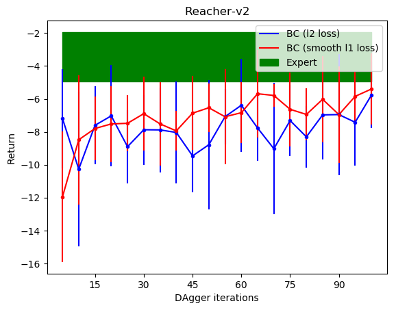
  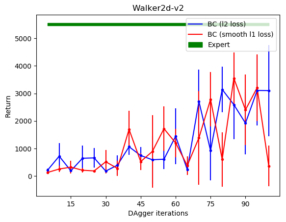

