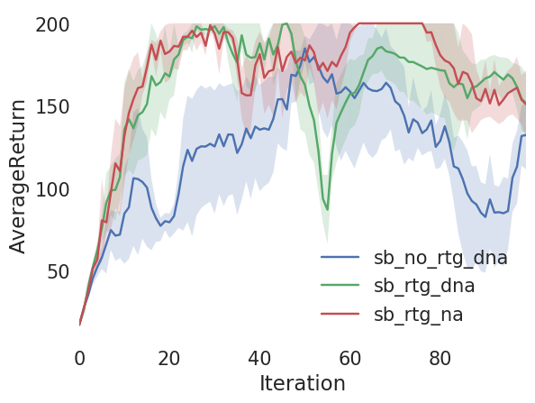
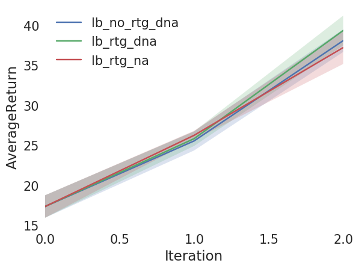
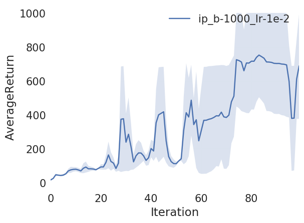
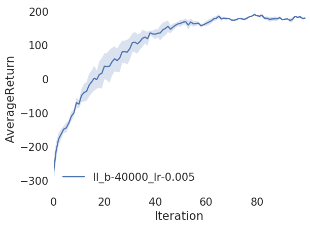
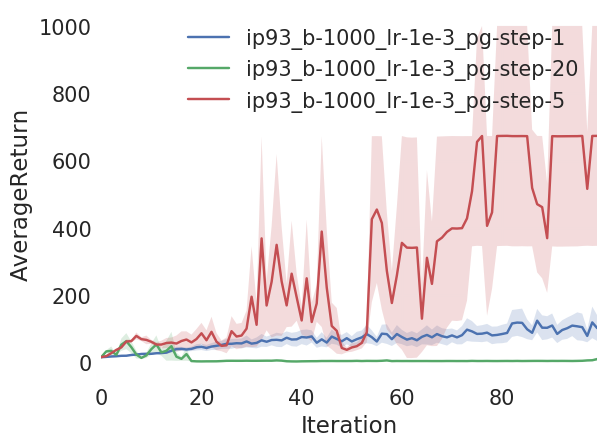

# CS294-112 HW 2: Policy Gradient

## Usage

To run all experiments and plot figures for the report, run

```bash
bash run_4.sh
bash run_5.sh
bash run_7.sh
bash run_811.sh
bash run_812.sh
bash run_813.sh
bash run_82.sh
bash run_93.sh
```

All data would be saved in `data/`; all figures would be saved in `results/`.

## Results
### Problem 1
#### 1a
For each term in equation 12, we have

<p align="center"></p>

Therefore, 

<p align="center"></p>

#### 1b
**a** Future states and actions are independent of previous states and actions given the current state according to the Markov property of MDP.

**b**

<p align="center"></p>

Therefore, 

<p align="center"></p>

### Problem 4

<p float="left">
  
  
</p>

* Reward-to-go has better performance than the trajectory-centric one without advantage-centering; reward-to-go converges faster and has lower variance.
* Advantage centering helps reduce the variance after convergence.
* Larger batch size helps reduce the variance.

### Problem 5

<p float="left">
  
</p>

### Problem 7

<p float="left">
  
</p>

### Bonus 3

I experimented taking multiple gradient descent steps with the same batch of data on InvertedPendulum.

<p float="left">
  
</p>

I need to decrease the learning rate to make it work. The effect in this case is essentially increasing the learning rate (although not exactly the same from an optimization perspective).

## Original README

Dependencies:
 * Python **3.5**
 * Numpy version **1.14.5**
 * TensorFlow version **1.10.5**
 * MuJoCo version **1.50** and mujoco-py **1.50.1.56**
 * OpenAI Gym version **0.10.5**
 * seaborn
 * Box2D==**2.3.2**

Before doing anything, first replace `gym/envs/box2d/lunar_lander.py` with the provided `lunar_lander.py` file.

The only file that you need to look at is `train_pg_f18.py`, which you will implement.

See the [HW2 PDF](hw2_instructions.pdf) for further instructions.
