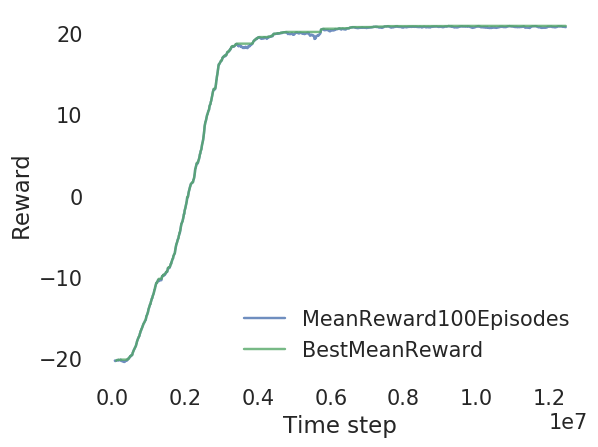
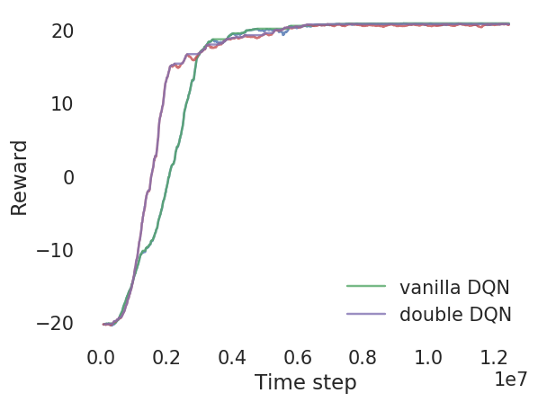
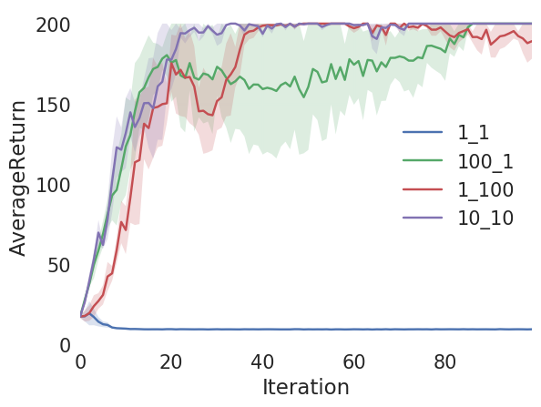
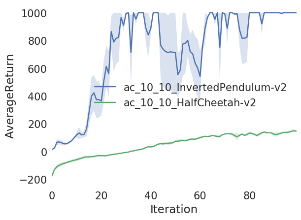

# CS294-112 HW 3: Q-Learning

## Usage

To run all experiments and plot figures for the report, run

```bash
bash run_11.sh
bash run_12.sh
bash run_13.sh
bash run_14.sh
python plot_part1.py
bash run_21.sh
bash run_22.sh
```

## Results
### Part 1
#### Question 1
<p float="left">
  
</p>

#### Question 2
<p float="left">
  
</p>

#### Question 3

I experimented the effect of discount factor on performance.

<p float="left">
  
</p>

As we can see, it takes longer to converge for small discount factor.

### Part 2
#### Question 1
<p float="left">
  
</p>

Setting both `num_grad_steps_per_target_update` and `num_target_updates` to 10 works best.

#### Question 2
<p float="left">
  
</p>

## Original README

Dependencies:
 * Python **3.5**
 * Numpy version **1.14.5**
 * TensorFlow version **1.10.5**
 * MuJoCo version **1.50** and mujoco-py **1.50.1.56**
 * OpenAI Gym version **0.10.5**
 * seaborn
 * Box2D==**2.3.2**
 * OpenCV
 * ffmpeg

Before doing anything, first replace `gym/envs/box2d/lunar_lander.py` with the provided `lunar_lander.py` file.

The only files that you need to look at are `dqn.py` and `train_ac_f18.py`, which you will implement.

See the [HW3 PDF](hw3_instructions.pdf) for further instructions.

The starter code was based on an implementation of Q-learning for Atari generously provided by Szymon Sidor from OpenAI.