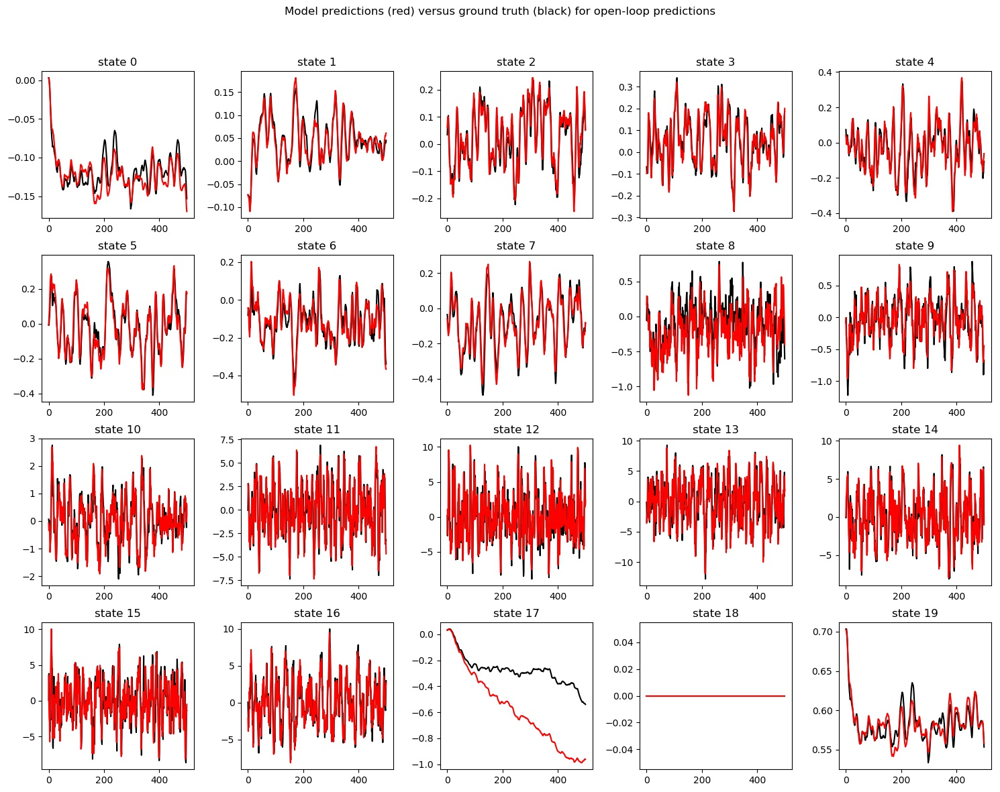
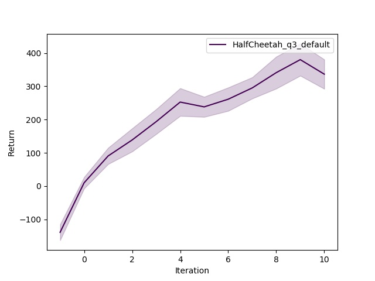
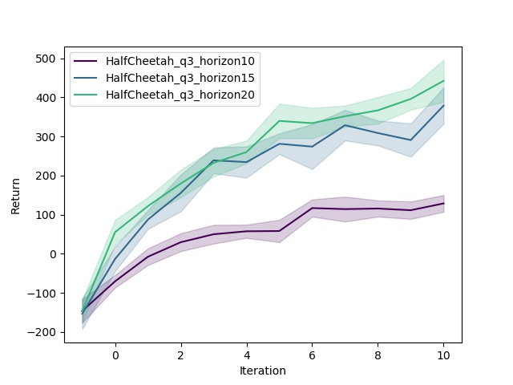
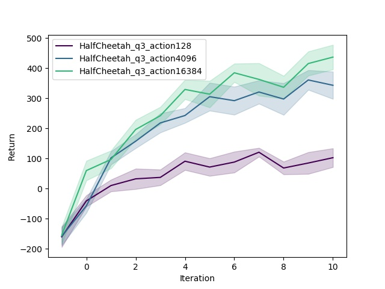
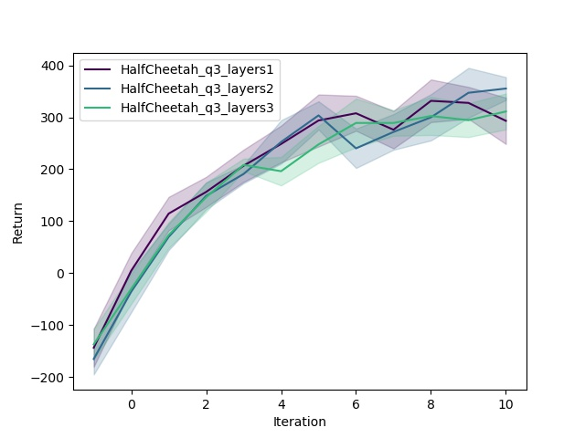

# CS294-112 HW 4: Model-Based Reinforcement Learning

## Usage

To run all experiments and plot figures for the report, run

```bash
bash run_all.sh
```

## Results
### Problem 1
#### (a)
<p float="left">
  
</p>

#### (b)

The predictions are the most inaccurate for state 17. The state changes almost monotonically for dimension 17 and the error accumulates more dramatically for later steps, while the errors at different directions are cancelled out to some extend for those fluctuating dimensions.

### Problem 2
#### (a)
| Return    | Random Policy | Trained Policy |
|-----------|---------------|----------------|
| ReturnAvg | -169.525      | 54.1579        |
| ReturnStd | 38.9955       | 23.4211        |

### Problem 3a
#### (a)
<p float="left">
  
</p>

### Problem 3b
#### (a)
<p float="left">
  
</p>

#### (b)
<p float="left">
  
</p>

#### (c)
<p float="left">
  
</p>