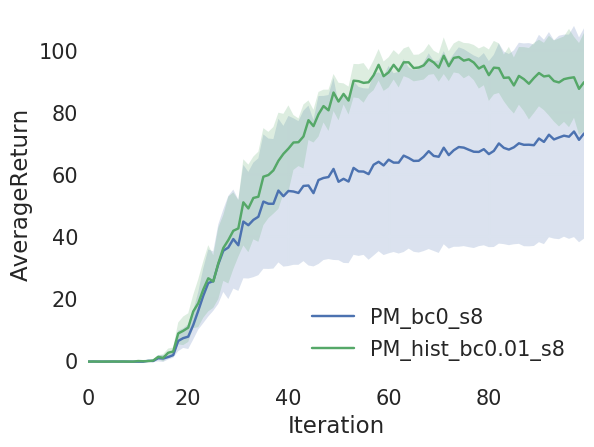
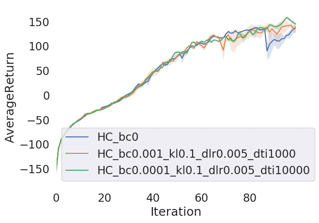

# CS294-112 HW 5a: Exploration

## Usage

To run all experiments and plot figures for the report, run

```bash
bash run_all.sh
```

## Results
### Problem 1
#### (a)
<p float="left">
  
</p>

### Problem 2
#### (a)
<p float="left">
  
</p>

### Problem 3
#### (a)
<p float="left">
  
</p>

### Problem 4
#### (a)
<p float="left">
  
</p>
#### (b)
Surprisingly, 3 curves are very similar. The baseline model without exploration has already achieved good performance, and EX2-based exploration cannot further improve the performance in this case.


## Original README

Dependencies:
 * Python **3.5**
 * Numpy version **1.14.5**
 * TensorFlow version **1.10.5**
 * MuJoCo version **1.50** and mujoco-py **1.50.1.56**
 * seaborn
 * tqdm==**4.26.0**

Before doing anything, first replace `gym/envs/mujoco/half_cheetah.py` with the provided `sparse_half_cheetah.py` file. It is always a good idea to keep a copy of the original `gym/envs/mujoco/half_cheetah.py` just in case you need it for something else.

You will implement `density_model.py`, `exploration.py`, and `train_ac_exploration_f18.py`.

See the hw5a.pdf in this folder for further instructions.
<!--See the [HW5 PDF](hw5a_instructions.pdf) for further instructions-->.
