# CS294-112 HW 5c: Meta-Learning
## Usage

To run all experiments and plot figures for the report, run

```bash
bash run_1.sh
bash run_21.sh
bash run_22.sh
bash run_23.sh
bash run_24.sh
bash run_25.sh
bash run_31.sh
bash run_32.sh
```

## Results
### 5.1 Problem 1
<p float="left">
  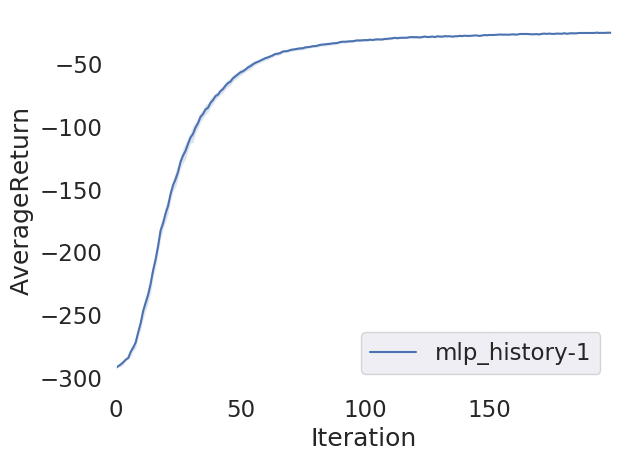
</p>

### 5.2 Problem 2
<p float="left">
  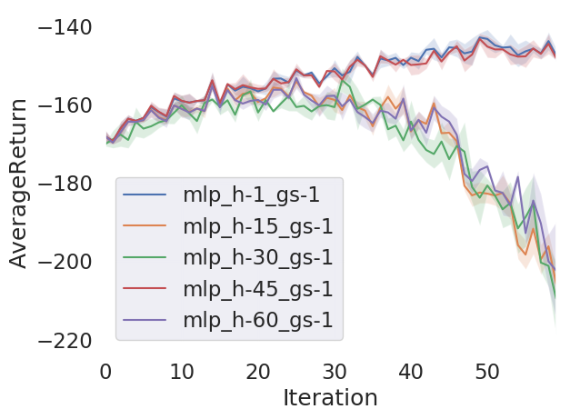
  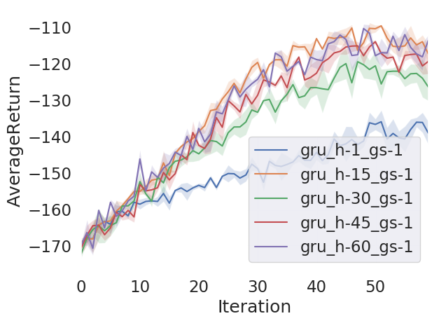
</p>
The feed-forward architectures fail to achieve good performance in all cases. For the recurrent architectures, the cases where history length is no less than 15 achieve similar performance, and significantly outperform history length of 1.

<p float="left">
  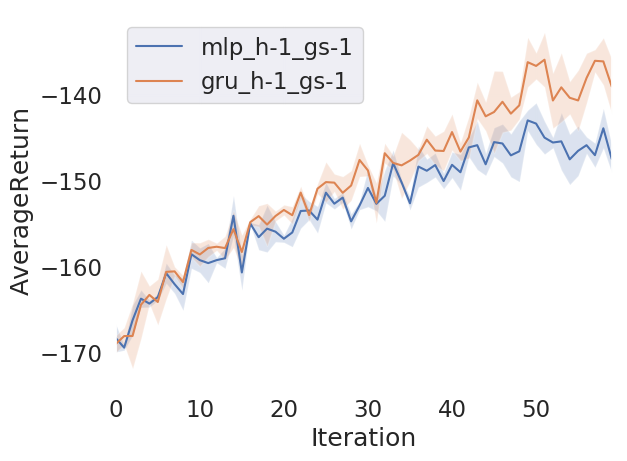
  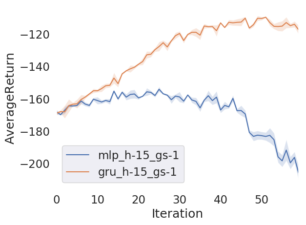
  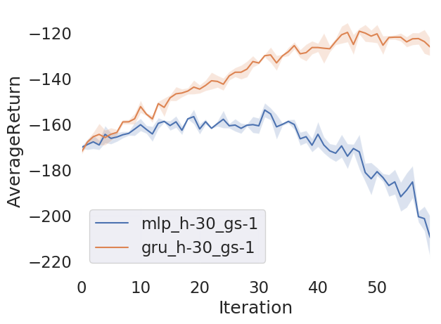
  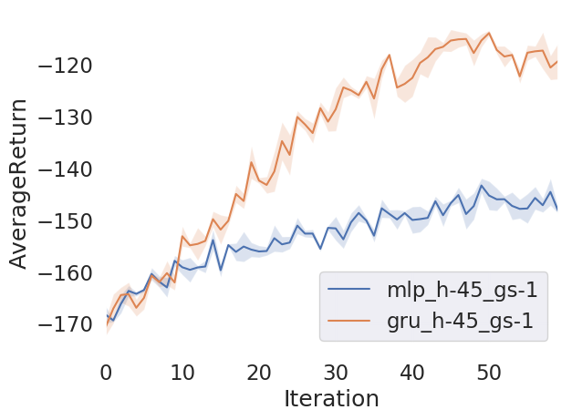
  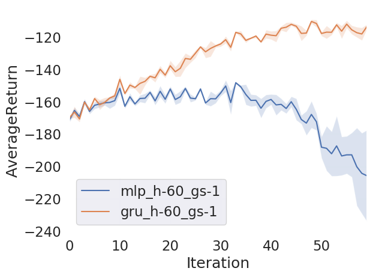
</p>
The recurrent architectures outperform the feed-forward architectures in all cases.

### 5.3 Problem 3
<p float="left">
  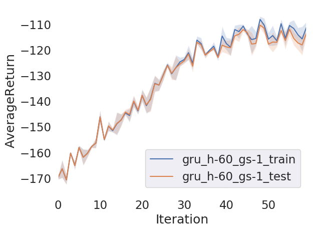
  
  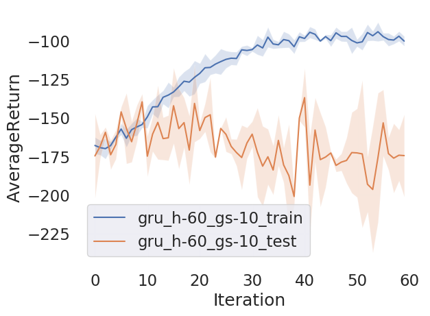
</p>
The policy performs similarly on training goals and testing goals for the grain size of 1 and 5. The algorithm overfits when I increase the grain size to 10, when the testing distribution deviates a lot from the training distribution.

<p float="left">
  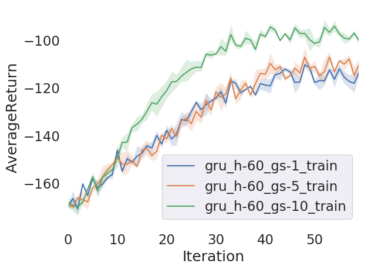
  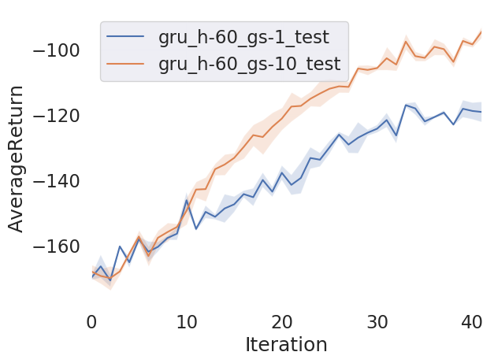
</p>
The performance on training goals is improved significantly when the grain size is 10, presumably because the decrease in the number of possible directions in the training goals makes it easier for the algorithm to learn a good policy. However, the testing performance is much worse since the directions in the testing goals differ a lot from those in the training goals.

## Original README
Dependencies:
 * Python **3.5**
 * Numpy version 1.14.5
 * TensorFlow version 1.10.5
 * MuJoCo version **1.50** and mujoco-py **1.50.1.56**
 * OpenAI Gym version **0.10.5**
 * seaborn
 * Box2D==2.3.2

See the [HW5c PDF](hw5c_instructions.pdf) for further instructions.
