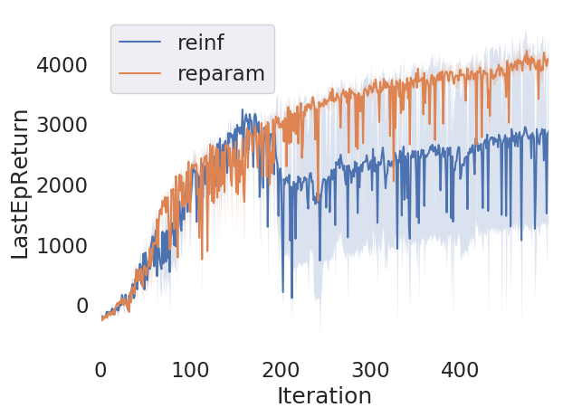
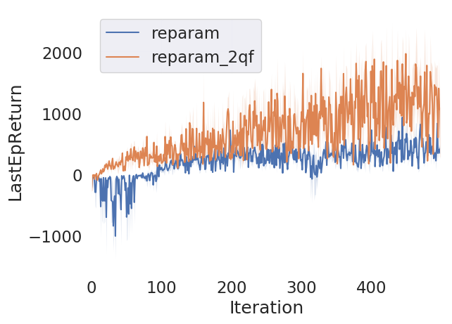

# CS294-112 HW 5b: Soft Actor-Critic
## Usage
To run all experiments and plot figures for the report, run

```bash
bash run_1.sh
bash run_2.sh
```

## Results
### Problem 1
#### Bonus Task
#### 1. In Task A, what was your choice of baseline, and why did you choose it?
I chose the value function as the baseline, since the state dependent value function is unbiased and is convenient to use.

#### 2. What are the pros and cons of the two types of gradient estimators?
(Copied from http://stillbreeze.github.io/REINFORCE-vs-Reparameterization-trick/)
<table>
  <thead>
    <tr>
      <th style="text-align: center"><strong>Properties</strong></th>
      <th style="text-align: center">REINFORCE</th>
      <th style="text-align: center">Reparameterization</th>
    </tr>
  </thead>
  <tbody>
    <tr>
      <td style="text-align: center"><strong>Differentiability requirements</strong></td>
      <td style="text-align: center">Can work with a non-differentiable model</td>
      <td style="text-align: center">Needs a differentiable model</td>
    </tr>
    <tr>
      <td style="text-align: center"><strong>Gradient variance</strong></td>
      <td style="text-align: center">High variance; needs variance reduction techniques</td>
      <td style="text-align: center">Low variance due to implicit modeling of dependencies</td>
    </tr>
    <tr>
      <td style="text-align: center"><strong>Type of distribution</strong></td>
      <td style="text-align: center">Works for both discrete and continuous distributions</td>
      <td style="text-align: center">In the current form, only valid for continuous distributions</td>
    </tr>
    <tr>
      <td style="text-align: center"><strong>Family of distribution</strong></td>
      <td style="text-align: center">Works for a large class of distributions of x</td>
      <td style="text-align: center">It should be possible to reparameterize x</td>
    </tr>
  </tbody>
</table>

#### 3. Why can we not use the reparameterization trick with policy gradients?
Reparameterization needs a differentiable model, and is only valid for continuous variables.

#### 4. We can minimize the policy loss in Equation 9 using off-policy data. Why is this not the case for standard actor-critic methods based on policy gradients, which require on-policy data?
Standard actor-critic methods require on-policy training to improve stability, while the maximum entropy formulation provides a substantial improvement in exploration and robustness, and both value estimators and the policy can be trained entirely on off-policy data in the soft actor-critic algorithm. 

### Problem 4
#### Task A
<p float="left">
  
</p>

The reparameterization method has lower variance and provides better stability.

#### Task B
<p float="left">
  
</p>

Double Q-learning mitigates positive bias in the policy improvement step, and thus results in better performance.

## Original README
Original code from Tuomas Haarnoja, Soroush Nasiriany, and Aurick Zhou for CS294-112 Fall 2018

Dependencies:
 * Python **3.4.5**
 * Numpy version **1.15.2**
 * TensorFlow version **1.10.0**
 * tensorflow-probability version **0.4.0**
 * OpenAI Gym version **0.10.8**
 * MuJoCo version **1.50** and mujoco-py **1.50.1.59**
 * seaborn version **0.9.0**

You will implement `sac.py`, and `nn.py`.

See the [HW5 PDF](hw5b_instructions.pdf) for further instructions.
